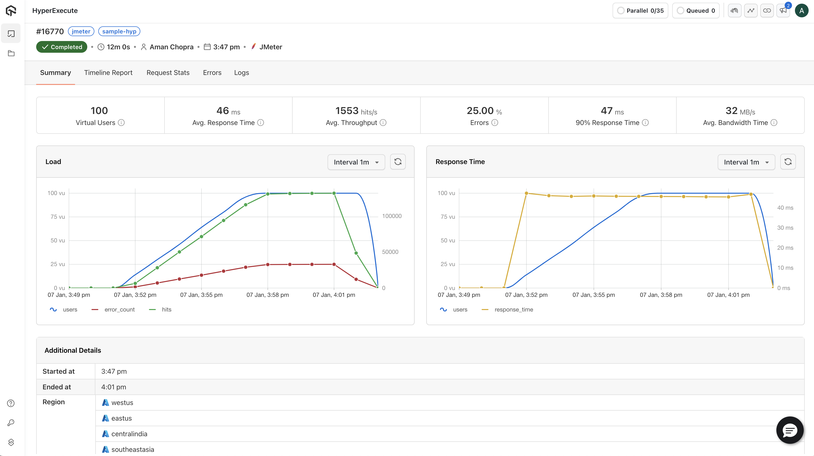

HyperExecute is a next-gen test execution platform by LambdaTest, designed to supercharge your test runs with unparalleled speed, scalability, and smart test management. Whether you're running cross-browser tests or executing your CI/CD pipeline, HyperExecute ensures efficiency and speed in the cloud.

HyperExecute is configured using a YAML file. Instead of moving the Hub close to you, HyperExecute brings the test scripts close to the Hub!

- [HyperExecute HomePage](https://www.lambdatest.com/hyperexecute)
- [Lambdatest HomePage](https://www.lambdatest.com)
- [HyperExecute JMeter Documentation](https://www.lambdatest.com/support/docs/hyperexecute-run-jmeter-tests/)
- [LambdaTest Support](mailto:support@lambdatest.com)
 

## 📖 Table of Contents
1. [Steps to run your test](#-steps-to-run-your-test)  
    1.1 [Setup your JMeter Project](#-setup-your-jmeter-project)  
    1.2 [Trigger your `.jmx` file](#-setup-your-jmeter-project)
4. [Repository Structure](#-repository-structure)
6. [Documentation & Resources](#-documentation--resources)
7. [Contributing](#-contributing)
8. [Contact & Support](#-contact--support)

## 🚀 Steps to run your test
> Before proceeding forward, make sure you have created your account on [LambdaTest](https://accounts.lambdatest.com/login)

Follow the steps below to get started with running Selenium TestNG tests on HyperExecute!
 

### Setup your JMeter Project
- Go to the [HyperExecute Project's Dashboard](https://hyperexecute.lambdatest.com/hyperexecute/projects) and click on the **New Project** button.
- Select **JMeter** as your **Type of Project**.
- Provide your project name.
- Browse and Upload the test plans that you have created (Optional).
- Click on the Save button.

### Trigger your `.jmx` file
- Upload your `.jmx` files if you haven't in the previous step.
- Now select all the `.jmx` files that you want to trigger and click on **Run** button.
- Define the `Total Users`, `Duration (min)`, and `Ramp-up Time (min)` and click on **Continue**.
- Select the regions in which you want to trigger your test, and define the traffic percentage.
- Click on the **Run Test** button.

## 🔍 Monitoring & Debugging
You can monitor your test execution in real-time using the [HyperExecute Dashboard](https://hyperexecute.lambdatest.com/hyperexecute).

## 📚 Documentation & Resources
For more details on how to run and customize tests with HyperExecute, check out:

- [HyperExecute Documentation](https://www.lambdatest.com/support/docs/getting-started-with-hyperexecute/)
- [HyperExcute API Documentation](https://www.lambdatest.com/support/api-doc/?key=hyperexecute)
- [HyperExecute Case Study Blogs](https://www.lambdatest.com/blog/category/hyperexecute/)

## 🤝 Contributing
We welcome contributions to improve this repository. Here's how you can contribute:

- Fork this repository.
- Create a new branch -> `git checkout -b YOUR_NAME/FIX_NAME`.
- Make your changes and commit them -> `git commit -m 'YOUR_COMMIT_MESSAGE'`.
- Push the branch to your fork -> `git push origin YOUR_NAME/FIX_NAME`.
- Open a Pull Request to the main repository.

## 📞 Contact & Support
Need help or have questions? Reach out to us:

- Email: support@lambdatest.com
- Visit our [Community Forum](https://community.lambdatest.com/)

Thank you for using HyperExecute! 🚀 Happy Testing!
